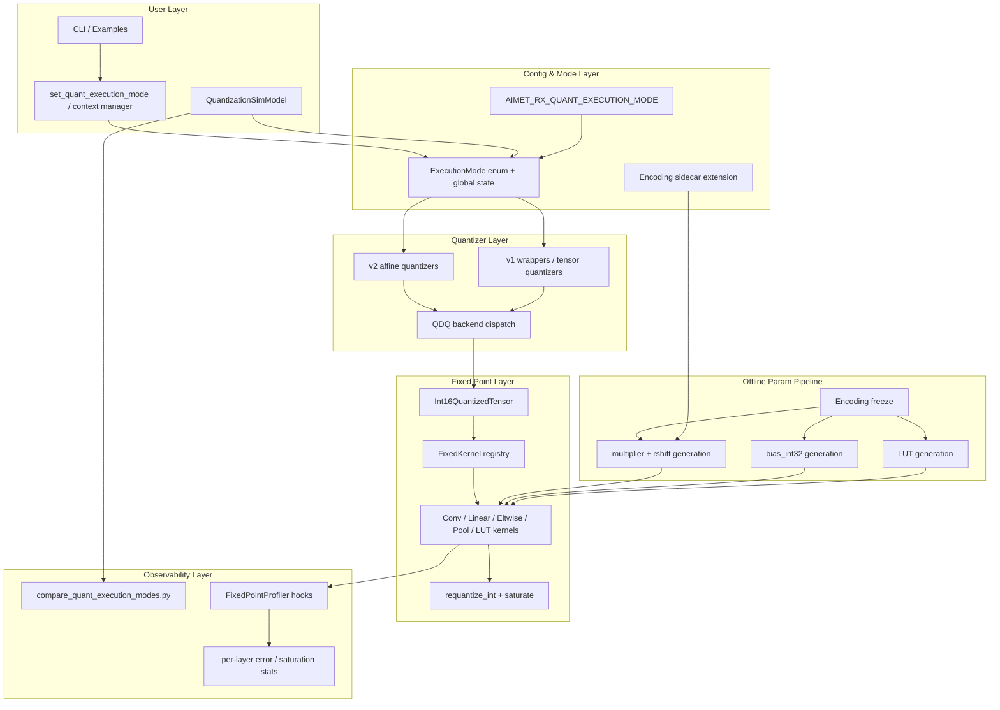
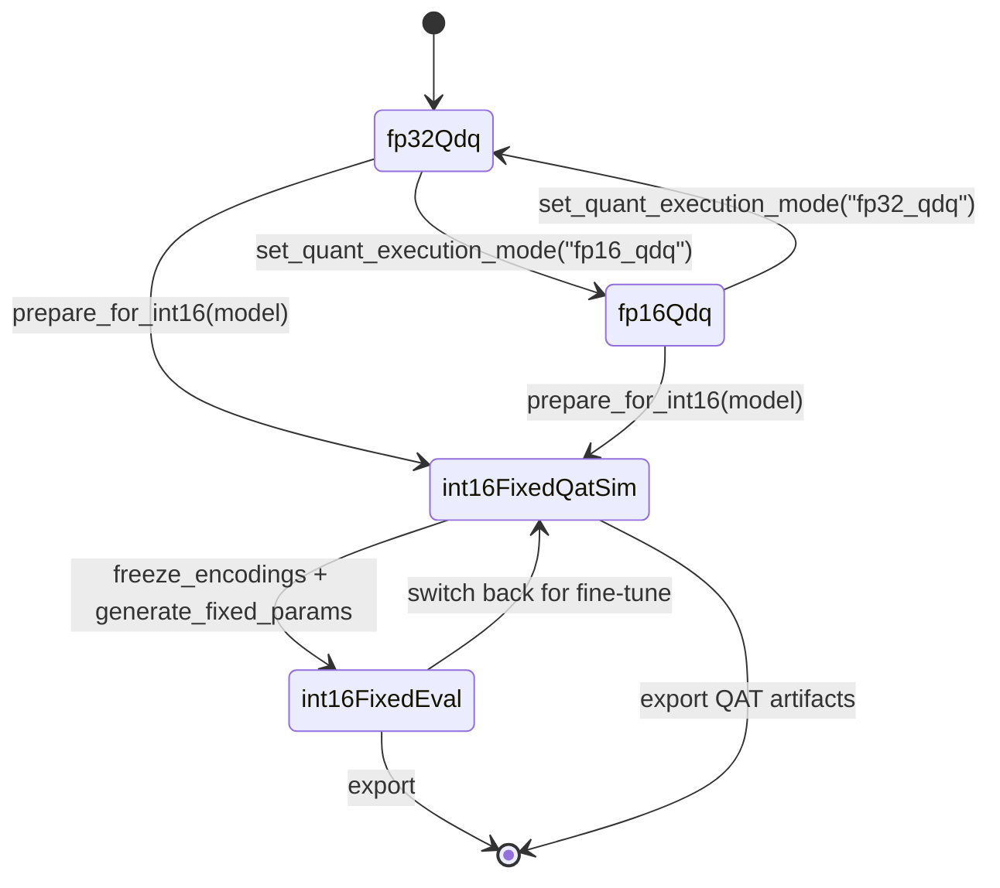

# AIMET RX 定点量化与计算改造设计方案

> **本文档已废弃，仅作历史归档。**  
> 定点量化与仿真请以 **[FixedPoint_Quantization_Design_v2.md](FixedPoint_Quantization_Design_v2.md)** 为准。

---

本文档为早期草稿归档，内容可能过时，请勿用于评审或实施。

可执行的实施细节、API 签名、伪代码、测试用例、验收标准全部拆分到独立 spec 文件，位于 `doc/FixedPoint_Quantization_Spec/` 目录。每个 spec 自包含、可被单一开发者或编码 agent 独立读取并实施。

公共接口契约位于 `aimet_torch/v2/quantization/affine/fixed_point/INTERFACE.md`，是所有 spec 与代码实现的单一事实源。

---

## 目录

1. 背景与目标
2. 词汇表与符号表
3. 三种执行模式
4. 系统分层架构
5. 模式状态机
6. AIMET 现状代码确认
7. v1 与 v2 差异
8. 决策日志（ADR）
9. 成功标准
10. 风险表
11. 里程碑
12. Spec 索引

---

## 1. 背景与目标

`aimet_rx` 基于 Qualcomm AIMET，提供 PyTorch/ONNX 模型的量化仿真、PTQ、QAT、混合精度、Power-of-2 scale 对齐与 ONNX + encodings 导出。本项目在此基础上扩展三种执行模式，对齐目标 NPU（Ada200 系列）的硬件能力。

目标：

- **现状（fp32_qdq）**：伪量化后以 `float32` 张量参与模块计算（保持兼容，不改变默认行为）。
- **需求 1（fp16_qdq）**：伪量化后以 `float16` 张量参与模块计算。
- **需求 2（int16_fixed）**：输入、权重、中间激活、输出全部以 `INT16` 表示，乘加用 `INT32` 累加，**运行时禁止任何浮点 tensor 计算**。

设计原则：

- 默认行为保持兼容。
- 新能力通过显式 execution mode 开启。
- v2 作为主实现路径，v1 兼容接入。
- INT16 路径必须有明确定点算子语义，不得简单 `tensor.to(torch.int16)`。
- 每种模式必须可输出可解释的误差与统计指标。

---

## 2. 词汇表与符号表

为避免不同 spec 之间命名漂移，所有文档统一使用以下术语与符号。

### 2.1 术语

- **伪量化（fake quantization / QDQ）**：使用浮点张量模拟量化网格效果。AIMET 当前默认行为。
- **真定点计算（true fixed-point）**：全程使用整数算术，包含 scale、zero-point、shift、saturate。
- **QDQ**：Quantize-Dequantize。AIMET 当前主要量化仿真路径。
- **execution mode**：本项目新增的统一执行模式概念，取值 `fp32_qdq` / `fp16_qdq` / `int16_fixed_eval` / `int16_fixed_qat_sim`。
- **encoding**：AIMET 中量化参数的描述对象，含 scale、offset、qmin、qmax、bitwidth。
- **multiplier + shift requantize**：整数域内将累加值重新缩放到目标整数网格的方式，公式 `y = (x * multiplier) >> rshift`。
- **STE**：Straight-Through Estimator。QAT 中处理 `round` / `clamp` 等不可导算子的反向技巧。
- **surrogate gradient**：对不可导前向使用的可导替代函数及其导数。
- **LUT**：Look-Up Table。INT16 模式下近似非线性函数的查表方式。

### 2.2 张量与参数符号

下表为全文统一符号约定，spec 与代码必须遵守。

- `x_int16` `torch.int16` 输入张量
- `w_int16` `torch.int16` 权重张量
- `bias_int32` `torch.int32` 偏置（量化到 `x_scale * w_scale`）
- `acc_int32` `torch.int32` 卷积/线性层的累加结果
- `x_scale` / `w_scale` / `y_scale` 输入、权重、输出浮点 scale，仅离线生成 multiplier 时使用
- `x_zp` / `w_zp` / `y_zp` 各张量的 zero-point，整数
- `multiplier` `torch.int16` 离线生成的整数乘子（Q15 形式）
- `rshift` 非负整数右移位数
- `qmin` / `qmax` 整数网格上下界，由 bitwidth 与有符号性决定
- `real_multiplier` 浮点中间量 `x_scale * w_scale / y_scale`，**仅离线参数生成阶段使用**，运行时严禁出现

---

## 3. 三种执行模式

### 3.1 模式枚举

- `fp32_qdq` **默认**。等同当前 AIMET 行为。QDQ 输出与计算均为 `float32`。
- `fp16_qdq` 需求 1。QDQ 输出与计算为 `float16`。
- `int16_fixed_eval` 需求 2 的推理形态。全链路整数。
- `int16_fixed_qat_sim` 需求 2 的训练形态。前向模拟整数与硬件 bit-exact 一致；反向通过 STE / surrogate gradient 走浮点梯度。

### 3.2 模式适用关系

- 推理 / 评估：四种模式都可使用。
- QAT 训练：仅 `fp32_qdq` / `fp16_qdq` / `int16_fixed_qat_sim` 可使用。`int16_fixed_eval` 因前向不可导，仅用于推理仿真与精度评估。
- 导出：`int16_fixed_qat_sim` 训练完成后，固化 encoding，再切换到 `int16_fixed_eval` 输出最终精度报告与硬件参数。

---

## 4. 系统分层架构

每一层的接口细节见对应 spec 文件，参见第 12 节索引。

---

## 5. 模式状态机

约束：

- 进入 `int16_fixed_*` 前必须完成 calibration 并 freeze encoding。
- 离线参数（multiplier / rshift / bias_int32 / LUT）由独立 pipeline 生成；模式切换不会触发自动重算。
- 切换模式禁止在单次 forward 内进行；建议在两次 forward 之间或 epoch 边界。

---

## 6. AIMET 现状代码确认

当前 v1 与 v2 的伪量化主路径都是：**float input → QDQ 到浮点 → 原 PyTorch 模块浮点计算 → 输出再 QDQ**。即使 QDQ 数值落在整数网格上，PyTorch 张量 dtype 仍为浮点（默认 `float32`），不存在真正的整数 kernel 计算。

关键代码位置：

- v2 QDQ 核心：[aimet_torch/v2/quantization/affine/backends/torch_builtins.py](../aimet_torch/v2/quantization/affine/backends/torch_builtins.py) 中的 `QuantDequantFunc`。
- v2 量化器入口：[aimet_torch/v2/quantization/affine/quantizer.py](../aimet_torch/v2/quantization/affine/quantizer.py) 中的 `QuantizeDequantize.forward()`。
- v2 模块参数 patch：[aimet_torch/v2/nn/base.py](../aimet_torch/v2/nn/base.py) 中的 `_patch_quantized_parameters()`。
- v1 STE QDQ：[aimet_torch/v1/quantsim_straight_through_grad.py](../aimet_torch/v1/quantsim_straight_through_grad.py)。
- v1 wrapper forward：[aimet_torch/v1/qc_quantize_op.py](../aimet_torch/v1/qc_quantize_op.py)。

代码片段与 dtype 行为详细分析见 [02_fp16_qdq_v2.md](FixedPoint_Quantization_Spec/02_fp16_qdq_v2.md) 与 [03_fp16_qdq_v1.md](FixedPoint_Quantization_Spec/03_fp16_qdq_v1.md)。

---

## 7. v1 与 v2 差异

- **v1**：老版 wrapper 架构，`QcQuantizeWrapper` 包住原模块；input/param/output quantizer 以 list 管理；量化公式分散在 `TensorQuantizer` 与 STE autograd function。改造侵入面广。
- **v2**：新版量化模块体系，`QuantizerBase` / `QuantizedTensor` / `EncodingBase` 抽象清晰；affine backend 已有 `quantize` / `dequantize` / `quantize_dequantize` 三层；`true_quant.py` 已具备 quantized tensor 传递与自定义 kernel 的基础设施。改造首选 v2。

设计取舍：

- v2 是核心实现与验证主线，全部新功能优先在 v2 完成。
- v1 走兼容接入，复用 v2 的 `aimet_torch/fixed_point/...` 公共工具；如全模块覆盖成本过高，先保证常用 wrapper、QDQ 路径与重点模块。

---

## 8. 决策日志（ADR）

每条决策遵循格式：背景 → 决策 → 备选 → 后果 → 状态。

### ADR-001 multiplier 位宽固定为 16 位

- 背景：Ada200 硬件提供 16 位整数乘子。
- 决策：所有 requantize multiplier 使用 `int16` Q15 形式，并配 `rshift`。
- 备选：32 位 multiplier（Q31）精度更高但与硬件不一致。
- 后果：与硬件 bit-exact 对齐；离线生成时需评估 16 位精度损失。
- 状态：已采纳。

### ADR-002 `int16_fixed` 运行时严禁浮点

- 背景：Ada200 不提供浮点单元。
- 决策：`int16_fixed_eval` 与 `int16_fixed_qat_sim` 的前向必须全程整数；任何中间浮点 tensor 计算视为缺陷。
- 备选：允许 unsupported op 自动 fp fallback。
- 后果：实现侵入面增加；unsupported op 必须显式抛错或团队批准例外。
- 状态：已采纳。

### ADR-003 累加器使用 `int32`

- 背景：Conv/Linear 累加规模可能超出 `int16`。
- 决策：所有乘加类算子使用 `int32` 累加；中间乘法可使用 `int64` 防溢出。
- 备选：`int16` 累加（必然溢出）。
- 后果：runtime 内存与算力开销可控；溢出检测仍需运行时统计。
- 状态：已采纳。

### ADR-004 溢出策略选 saturate

- 背景：硬件对溢出的处理需明确。
- 决策：所有 requantize / cast 至窄类型时使用 saturating clamp。
- 备选：wrap-around。
- 后果：溢出值产生饱和误差，可被观测；与 TFLite/QNNPACK 主流方案一致。
- 状态：已采纳。

### ADR-005 v1/v2 共用 fixed kernel registry

- 背景：避免两套定点实现漂移。
- 决策：`aimet_torch/fixed_point/...` 提供与 v1/v2 解耦的 `FixedKernel` 协议与 registry；v1/v2 各写 thin adapter。
- 备选：v1 与 v2 各自维护一套 kernel。
- 后果：测试与维护成本下降；adapter 需各自适配 wrapper 数据流。
- 状态：已采纳。

### ADR-006 QAT 通过 `int16_fixed_qat_sim` 实现

- 背景：`int16_fixed_eval` 前向不可导。
- 决策：新增 `int16_fixed_qat_sim` 模式，前向模拟硬件整数行为，反向通过 STE / surrogate gradient 在浮点域反传。
- 备选：禁止 INT16 模式 QAT。
- 后果：实现复杂度上升；保留训练能力符合业务需求。
- 状态：已采纳。

### ADR-007 非线性函数走 LUT 分阶段交付

- 背景：Sigmoid / Tanh / Softmax / GELU 在整数域无法直接计算。
- 决策：使用 INT16 LUT 实现，分阶段交付：第一阶段仅 ReLU / Clamp；第二阶段 Sigmoid / Tanh；Softmax / GELU 单列评估。
- 备选：多项式近似、整段 fp fallback。
- 后果：LUT 表大小与精度需逐 op 调优；未覆盖前严格抛错。
- 状态：已采纳。

### ADR-008 舍入规则统一并与硬件对齐

- 背景：右移舍入直接影响 bit-exact 仿真。
- 决策：默认采用 `round half to even`，待硬件文档确认后切换；舍入规则在 `INTERFACE.md` 中定义为常量。
- 备选：`round half away from zero`、纯截断。
- 后果：仿真与硬件可对齐；切换需回归测试覆盖。
- 状态：待硬件团队最终确认；当前默认 `round half to even`。

---

## 9. 成功标准

下列阈值为团队对齐后的可验收门槛。CI 与里程碑验收以此为准。

### 9.1 精度

- `fp16_qdq` vs `fp32_qdq`：分类任务 top1 跌落 ≤ 0.5%；逐层输出 cosine similarity ≥ 0.9995。
- `int16_fixed_eval` vs `fp32_qdq`：分类任务 top1 跌落 ≤ 1.0%；逐层 cosine similarity ≥ 0.999。
- `int16_fixed_qat_sim` 训练后：vs 原始 fp32 baseline，top1 跌落 ≤ 0.3%。

### 9.2 性能

分级目标：

- Tier A（必达）：算子 golden test 在单卡 GPU 上 < 1s 完成。
- Tier B（应达）：tiny model（<10 层 Conv-BN-ReLU）端到端推理 < 10s。
- Tier C（择优）：业务 P0 模型 QAT 单步耗时 ≤ `fp32_qdq` 的 5×。

### 9.3 兼容性

- 默认 `fp32_qdq` 行为下，`QuantizationSimModel` API 与现有 encodings 文件 100% 兼容。
- 现有 `examples/quick_start.py` 不需修改即可继续运行。
- 现有 ONNX + encodings 导出在默认模式下输出 bit-exact 一致。

---

## 10. 风险表

按风险等级 H / M / L 列出。每条记录：描述、等级、触发条件、缓解、责任域。

### R-001 PyTorch 缺失 int16 conv kernel

- 等级：H
- 触发条件：`int16_fixed` 调用 Conv 类算子。
- 缓解：自实现 int16 GEMM-based conv（参考 `quant-gru-pytorch`）；性能敏感模型先用 numpy/cython，再考虑自写 CUDA。
- 责任域：fixed kernel 实现。

### R-002 float16 在 CPU 上 op 支持不全

- 等级：M
- 触发条件：`fp16_qdq` 在仅 CPU 环境运行 BatchNorm / LayerNorm / Softmax / GRU。
- 缓解：CUDA 优先；明确不支持的 op 列入文档；必要时为关键归一化层提供 fp32 fallback 开关（默认关闭）。
- 责任域：fp16 路径实现。

### R-003 multiplier 16 位精度损失

- 等级：M
- 触发条件：scale 极小或极大模型。
- 缓解：离线生成阶段输出 multiplier 量化前后误差报告；超阈值时报警。
- 责任域：离线 pipeline。

### R-004 舍入规则与硬件不一致

- 等级：M
- 触发条件：硬件实际舍入与默认 `round half to even` 不同。
- 缓解：在 `INTERFACE.md` 集中定义舍入；提供切换开关；硬件 reference 上线后做 bit-exact 回归。
- 责任域：requantize 实现。

### R-005 unsupported op 静默 fallback

- 等级：H
- 触发条件：未注册 fixed kernel 的算子被调用。
- 缓解：默认抛错；fallback 必须由配置显式开启并记录到 metrics 报告。
- 责任域：registry 与 mode 层。

### R-006 QAT half 训练不稳定

- 等级：M
- 触发条件：`fp16_qdq` 下训练 loss 出现 NaN 或精度大幅下降。
- 缓解：`int16_fixed_qat_sim` 反向使用 fp32 梯度；`fp16_qdq` 训练标记为 experimental；提供 loss scale 配置。
- 责任域：QAT 路径。

### R-007 LUT 精度损失放大

- 等级：M
- 触发条件：Sigmoid / Tanh / Softmax 在 INT16 LUT 下端到端精度劣化。
- 缓解：LUT 分辨率可配置；提供 LUT 误差独立指标；必要时升级 LUT bitwidth 或调整切分。
- 责任域：LUT kernel。

### R-008 v1 改造范围失控

- 等级：M
- 触发条件：v1 wrapper 与新模式集成耗时超预期。
- 缓解：v1 仅保证常用 wrapper 与 QDQ 路径；非核心模块允许暂不支持并文档说明。
- 责任域：v1 adapter。

---

## 11. 里程碑

每个里程碑的具体 spec 列在第 12 节索引。

- **M1 现状确认与模式框架**：execution mode API、状态机、默认行为不变。
- **M2 fp16_qdq**：v2 优先，v1 跟进；tiny model 误差报告。
- **M3 INT16 fixed core**：`Int16QuantizedTensor`、`requantize_int`、saturate；Conv/Linear/Add/ReLU kernel；算子 golden test。
- **M4 INT16 fixed module coverage**：Pooling、shape-only、Concat、Mul；v1/v2 adapter 接入；未覆盖模块清单与显式抛错。
- **M5 离线参数 pipeline 与 QAT**：multiplier/rshift/bias_int32/LUT 离线生成；`int16_fixed_qat_sim` 反向。
- **M6 端到端误差对比与可观测性**：三模式（含 `int16_fixed_eval`）对比脚本；`FixedPointProfiler`；CI 回归基线。

---

## 12. Spec 索引

详细实施细节在 [doc/FixedPoint_Quantization_Spec/](FixedPoint_Quantization_Spec/) 目录。每份 spec 自包含、可独立实施。

按里程碑分组：

**M1 模式框架**

- [01_execution_mode_api.md](FixedPoint_Quantization_Spec/01_execution_mode_api.md)

**M2 fp16_qdq**

- [02_fp16_qdq_v2.md](FixedPoint_Quantization_Spec/02_fp16_qdq_v2.md)
- [03_fp16_qdq_v1.md](FixedPoint_Quantization_Spec/03_fp16_qdq_v1.md)

**M3 INT16 fixed core**

- [04_int16_tensor_and_encoding.md](FixedPoint_Quantization_Spec/04_int16_tensor_and_encoding.md)
- [05_requantize_int_kernel.md](FixedPoint_Quantization_Spec/05_requantize_int_kernel.md)
- [06_fixed_kernel_registry.md](FixedPoint_Quantization_Spec/06_fixed_kernel_registry.md)
- [07_conv_linear_kernel.md](FixedPoint_Quantization_Spec/07_conv_linear_kernel.md)

**M4 INT16 fixed module coverage**

- [08_eltwise_pool_concat_kernel.md](FixedPoint_Quantization_Spec/08_eltwise_pool_concat_kernel.md)
- [09_lut_nonlinear_kernel.md](FixedPoint_Quantization_Spec/09_lut_nonlinear_kernel.md)

**M5 离线参数 pipeline 与 QAT**

- [10_offline_param_pipeline.md](FixedPoint_Quantization_Spec/10_offline_param_pipeline.md)
- [11_qat_sim_backward.md](FixedPoint_Quantization_Spec/11_qat_sim_backward.md)

**M6 端到端误差对比与可观测性**

- [12_metrics_and_compare.md](FixedPoint_Quantization_Spec/12_metrics_and_compare.md)
- [13_tests_acceptance.md](FixedPoint_Quantization_Spec/13_tests_acceptance.md)
- [14_ci_and_baseline.md](FixedPoint_Quantization_Spec/14_ci_and_baseline.md)

**接口契约（单一事实源）**

- [aimet_torch/v2/quantization/affine/fixed_point/INTERFACE.md](../aimet_torch/v2/quantization/affine/fixed_point/INTERFACE.md)

---

## 附录 A 推荐阅读顺序

- 团队评审 / 新成员：1 → 2 → 3 → 4 → 5 → 8 → 9 → 11 → 12（顶层文档）
- 实施者 / 编码 agent：先读 INTERFACE.md，再按里程碑顺序读对应 spec。
- 模型工程师：1 → 3 → 9 → spec 12（误差报告）→ spec 10（离线参数）。
- 硬件 / 编译器对接人：3 → 8（ADR-001/002/003/004/008）→ INTERFACE.md → spec 05 → spec 07。
