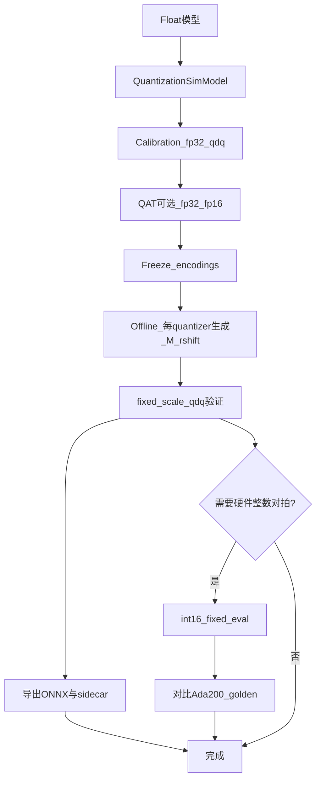
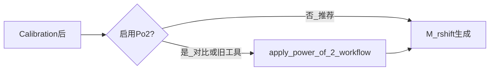
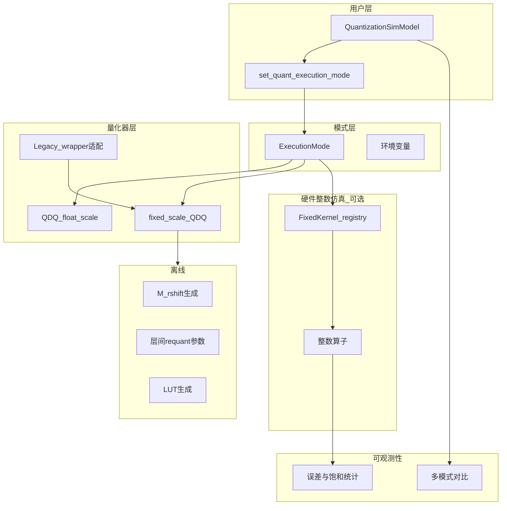
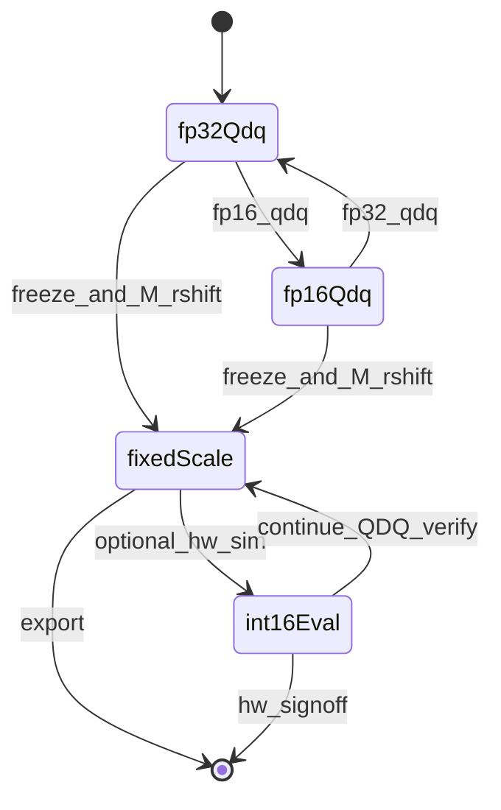

# AIMET RX 定点量化与仿真设计

| 字段 | 内容 |
|------|------|
| 版本 | 2.2 |
| 状态 | 已发布（M2.5 已实现；G3/M6 持续维护） |
| 实施细节 | [FixedPoint_Quantization_Spec/](FixedPoint_Quantization_Spec/00_overview.md) |
| API 契约 | [INTERFACE.md](../aimet_torch/v2/quantization/affine/fixed_point/INTERFACE.md) |

---

## 目录

1. [概述](#1-概述)
2. [目标与非目标](#2-目标与非目标)
3. [核心概念](#3-核心概念)
4. [执行模式](#4-执行模式-executionmode)
5. [端到端工作流](#5-端到端工作流)
6. [系统架构](#6-系统架构)
7. [模式状态机](#7-模式状态机)
8. [实现边界与代码索引](#8-实现边界与代码索引)
9. [决策日志（ADR）](#9-决策日志adr)
10. [验收标准](#10-验收标准)
11. [风险与缓解](#11-风险与缓解)
12. [里程碑与交付](#12-里程碑与交付)
13. [Spec 索引](#13-spec-索引)
- [附录 A 符号表](#附录-a-符号表)
- [附录 B 外部参考（QAT.axera）](#附录-b-外部参考qataxera)
- [附录 C 推荐阅读路径](#附录-c-推荐阅读路径)
- [附录 D 精度问题分流（运维）](#附录-d-精度问题分流运维)
- [变更记录](#变更记录)

---

## 1. 概述

### 1.1 项目定位

`aimet_rx` 在 Qualcomm **AIMET** 之上，为部署到 **Ada200 系列 NPU** 的模型提供：

- PyTorch / ONNX 的 **PTQ、QAT、混合精度** 量化仿真（**训练栈仍为 AIMET**，见 [§2.2](#22-非目标)）；
- **定点 scale** 表示与导出（INT16 系数 `M` + 移位 `rshift`）——Ada200 部署的 **必选能力**；
- **可选**的硬件整数仿真（整数 MAC、层间 requantize），用于芯片对拍；
- 与现有 AIMET 流程兼容的 **encodings / ONNX** 导出；
- **可选**的 Power-of-2 scale 后处理（`apply_power_of_2_workflow`）——**不是** Ada200 部署前置条件，见 [§3.6](#36-power-of-2-scale-对齐可选)。

### 1.2 文档边界

| 本文档 | 其他材料 |
|--------|----------|
| 目标、架构、模式、ADR、验收门槛 | [FixedPoint_Quantization_Spec/](FixedPoint_Quantization_Spec/00_overview.md)：可实施 spec |
| 概念与数据流 | [INTERFACE.md](../aimet_torch/v2/quantization/affine/fixed_point/INTERFACE.md)：API 与类型 |
| 工作流与角色分工 | [Quant_config.md](Quant_config.md)：QuantSim JSON 与混合精度 |

> **勿用历史 v1 文档定需求**：[`FixedPoint_Quantization_Design.md`](FixedPoint_Quantization_Design.md) 已废弃；其中「需求 2 = 全网 INT16、运行时禁止浮点」**不是**现行需求。现行需求见 [§2.2](#22-非目标) NG-3 与 [§3.3](#33-张量网格与-scale-正交)。

### 1.3 Ada200 与 scale 规范

硬件侧约定（产品输入）：

- 每个 quantizer 的步长 **scale** 用 **任意** 合法的 **`(M_int16, rshift)`** 表示：\(\text{scale} = M / 2^{\text{rshift}}\)。
- **不强制** scale 为 \(1/2^n\)（即 **不强制** Power-of-2 scale）。
- 权重、激活的 **bitwidth**（W4 / W8 / U8 / U16 等）由混合精度与模型配置决定，与 scale 的 `(M, rshift)` **相互独立**。

### 1.4 两类仿真路径（总览）

| 路径 | execution mode | 中间计算 | 主要用途 |
|------|----------------|----------|----------|
| **QDQ 主路径** | `fixed_scale_qdq`（及校准阶段的 `fp32_qdq` / `fp16_qdq`） | quantizer 边界 Q/DQ 后 **Op_float** | PTQ / QAT、导出、与 fp32 对比 |
| **硬件整数仿真** | `int16_fixed_eval`（可选 `int16_fixed_qat_sim`） | 段间 **int** + 层间 requant | Ada200 bit-exact、与主路径对比 |

两条路径 **数值不等价**；不得仅用主路径 sign-off 芯片整数行为。详见 [§3.1](#31-两种仿真路径)。

---

## 2. 目标与非目标

### 2.1 功能目标

| 编号 | 能力 | 说明 |
|------|------|------|
| — | **默认兼容** | `fp32_qdq` 与现有 `QuantizationSimModel`、encodings 行为一致 |
| **G1** | `fp16_qdq` | 伪量化后以 `float16` 参与模块计算（experimental） |
| **G2** | `fixed_scale_qdq` | 每个 quantizer 的 scale 以 **`(M, rshift)`** 为权威；Q/DQ 用定点 scale；模块内仍为 Op_float |
| **G3** | `hardware_integer_sim` | 可选整数前向 + 层间 requant，用于硬件验收 |

**约束 G2-A**：**每一个** quantizer（输入激活、权重、输出激活等）的 encoding 均可导出并仿真为 `(m_int16, rshift)`。

### 2.2 非目标

本节列出 **明确不在本项目范围内** 的事项，便于评审时与 [§2.1 功能目标](#21-功能目标) 区分。**非目标 ≠ 需求**；下列条目表示 **禁止或不做**，除非另开变更评审。

| 编号 | 非目标（不做） | 本项目实际做法 |
|------|----------------|----------------|
| NG-1 | 用 QDQ 主路径（`fixed_scale_qdq`）结果 **代替** 硬件整数仿真或板端 sign-off | 主路径用于 PTQ/QAT/导出；芯片验收走 **G3** 或板端 golden（[§1.4](#14-两类仿真路径总览)） |
| NG-2 | 以 QAT.axera 等 **替代** AIMET 作为训练栈 | **继续用 AIMET** `QuantizationSimModel`；仅 **借鉴** 区域混合精度 JSON 等配置思路（[附录 B](#附录-b-外部参考qataxera)） |
| NG-3 | 要求全网张量 dtype 为 `torch.int16` | 仅 **scale** 用 `(M, rshift)`；权/活 bitwidth 按混合精度配置（[§3.3](#33-张量网格与-scale-正交)） |
| NG-4 | 在单次 `forward` 内切换 execution mode | 仅在两次 forward 或 epoch 边界切换（[§4.3](#43-切换约束)） |
| NG-5 | 将 Power-of-2 scale 对齐设为 Ada200 部署的 **前置必要条件** | Po2 为 **可选** 后处理；Ada200 规范为 **任意** `(M, rshift)`，主线 **跳过 Po2**（[§3.6](#36-power-of-2-scale-对齐可选)、ADR-011） |

### 2.3 设计原则

- **默认不变、新能力显式开启**（execution mode / 环境变量）。
- **scale 表示与权/活 bitwidth 正交**。
- **新功能优先在 AIMET v2 quantizer 体系实现**；legacy wrapper 走薄适配。
- 每种路径具备 **可观测** 的误差与对比指标。
- 文档、CI、验收 **不假设** 两条仿真路径等价。

---

## 3. 核心概念

### 3.1 两种仿真路径

```text
QDQ 主路径 (fixed_scale_qdq):
  fp ──[Q/DQ(M,r)]── fp ══Op_float══ fp ──[Q/DQ]── … ──[Q/DQ]── fp

硬件整数仿真 (int16_fixed_eval):
  fp ──[Q]── int ══Op_fix+Req══ int ══ … ══ int ──[DQ(M,r)]── fp
```

| 维度 | QDQ 主路径 | 硬件整数仿真 |
|------|------------|--------------|
| scale 用于 | 各 quantizer 的 Q、DQ | Q、层间 Req、末端 DQ |
| 段间载体 | float（已在量化网格上） | 整数 q |
| 累加 | float 域 | int32（等）MAC 后 requant |
| 典型精度 | 更接近 fp32 baseline | 更接近芯片，往往更悲观 |
| 与 AIMET | 扩展 QDQ | 独立 `fixed_point` kernel registry |

### 3.2 定点 scale：M 与 rshift

对每个 quantizer：

\[
\text{scale} = \frac{M}{2^{\text{rshift}}}, \quad M \in \mathbb{Z},\ -32768 \le M \le 32767
\]

| 字段 | 说明 |
|------|------|
| `M` | INT16 系数；可 per-tensor 或 per-channel |
| `rshift` | 非负整数右移位数 |
| 运行时（`fixed_scale_qdq`） | Q/DQ **仅** 使用 `(M, rshift)`，不以 float scale 为权威 |

**量化（概念）**：

\[
q = \mathrm{clamp}\big(\mathrm{round}(x \cdot 2^{\text{rshift}} / M) - z_p,\ q_{\min}, q_{\max}\big)
\]

**反量化（概念）**：

\[
\tilde{x} = (q + z_p) \cdot M / 2^{\text{rshift}}
\]

舍入规则、对称性、广播规则以 INTERFACE 与 spec 15 为准。

**离线生成**：校准得到 float `scale` 后，用 `quantize_scale_to_m_rshift`（与 `offline/multiplier.py` 同族算法）为每个 quantizer 生成 `(M, rshift)`，并写入 encoding sidecar。

### 3.3 张量网格（与 scale 正交）

| 参数 | 作用 | 示例 |
|------|------|------|
| `bitwidth` / `qmin` / `qmax` | 整数网格范围 | 权 S8；活 U8 / U16 |
| `zero_point` | 非对称零点 | 权常 zp=0 |
| `axis` | per-tensor / per-channel | 权常 per-channel |

同一层可 **W8 权 + U16 活**：各自 `(M, rshift)` 与 `qmin/qmax`；在 QDQ 主路径下分别 Q/DQ 后进入 `Op_float`。

### 3.4 层间 requant（仅硬件整数仿真）

卷积 / 线性输出合并 scale：

\[
q_y = \mathrm{requant}\Big(\sum q_x q_w;\ M_{\text{req}}, r_{\text{req}}\Big), \quad
\frac{M_{\text{req}}}{2^{r_{\text{req}}}} \approx \frac{s_x \cdot s_w}{s_y}
\]

层间 `multiplier` 常为 INT16 Q15（ADR-001）。**QDQ 主路径不在层间做该整数 requant**，仅在 quantizer 边界 Q/DQ。

### 3.5 示例网络（I → A → B → C → D → O）

**QDQ 主路径**：I 入口 Q/DQ → float；A~D 内 `Op_float`，每层/每 quantizer 边界 Q/DQ；O 输出 float。

**硬件整数仿真**：I 仅 Q → int；A~D 为 `Op_fix` + Req；O 末 DQ → float。

同一套 `(M, rshift)` 与 bitwidth 可共用，但 **数值结果通常不同**。

### 3.6 Power-of-2 scale 对齐（可选）

> **与非目标的关系**：Po2 是仓库内 **已有、可选用** 的工具能力；**非目标 NG-5** 禁止的是把它写成「Ada200 上线必做步骤」。本节说明 Po2 是什么、何时用、何时不用。

**Power-of-2（Po2）对齐**是校准后的 **可选后处理**：将各 quantizer 的 float `scale` 调整为 \(\text{scale} = 1/2^n\)，便于部分只支持移位的工具或对比实验。实现：`apply_power_of_2_workflow`（[`power_of_2_quantization.py`](../aimet_torch/power_of_2_quantization.py)）。

| | Po2 对齐 | 定点 scale `(M, rshift)` |
|---|----------|---------------------------|
| 约束对象 | float scale 的 **取值**（只能是 \(2^{-n}\)） | scale 的 **表示与 Q/DQ 算法** |
| Ada200 | **非必须**（规范为任意 M,r） | **必须**（部署权威） |
| 典型顺序 | 校准 → [可选 Po2] → 生成 M,r | 校准 → 生成 M,r → `fixed_scale_qdq` |
| 关系 | Po2 是 M,r 可表达的 **子集**（如 `M=1, rshift=n`） | 直接近似校准 scale，通常 **更贴 PTQ 结果** |

**推荐**：面向 Ada200 的主线 **跳过 Po2**，校准后 **直接** 生成 `(M, rshift)`。仅在需要做 Po2 子集对比或兼容旧流水线时启用 Po2。

### 3.7 G2 与 G3 的 encoding 分工（避免误读 ADR-009）

ADR-009 的「全 quantizer encoding scale 权威为 `(m_int16, rshift)`」指 **G2 主路径与导出 sidecar**；**不**表示 G3 整数仿真已在运行时全程用 `(M,r)` 做边界 Q/DQ。两层参数勿混用：

| 层级 | G2 `fixed_scale_qdq` | G3 `int16_fixed_*` |
|------|----------------------|---------------------|
| quantizer 边界 scale | 运行时 Q/DQ 用 **`(M, rshift)`**（见 spec 15） | 默认 float `scale`；`convert_encodings_to_fixed_scale` 或 `AIMET_RX_INT16_BOUNDARY_USE_M_R=1` 时用 **`(M,r)`**（`quantize_boundary_from_affine`）；**导出**含 `m_int16`/`rshift` |
| 层间 requant | **无**（段间 `Op_float`） | `OutputEncoding.multiplier` / `rshift`（\(M_{\text{req}}/2^{r_{\text{req}}} \approx s_x s_w / s_y\)，与 quantizer 的 M,r **公式不同**） |
| 段间载体 | float 量化网格值 | `int_repr` + 元数据；`qmin/qmax` 由 bitwidth 决定（**非**「全网 U16」） |

`Int16QuantizedTensor`（代码别名 **`FixedPointSimTensor`**）为 **G3 整数仿真段载体** 的历史类名，**不表示**权/活语义 bitwidth 均为 16；对外文档宜写「定点仿真载体」而非「INT16 张量」。

**容器 dtype 与值域分离（ADR-013/014）**：自 v2.1 起，sim-tensor 容器 dtype 统一为 `torch.int32`（`SIM_TENSOR_DTYPE`），值域受 `(qmin, qmax)` 与 `bitwidth` 约束；**INT16 仅指值域**而**非容器**。该选择基于：

- PyTorch CPU/CUDA 对 `int32` 的支持比 `int16` 更全面（`F.unfold`、`MaxPool` 等可保持纯整数路径，避免 ADR-002 禁止的 float 中间量）；
- 累加可直接进入 int32 槽，省去 `int16 ↔ int32` 来回 cast；
- byte-stream / sidecar / ONNX 导出仍按 `int16` 截位序列化（受 `(qmin, qmax)` 约束），**与硬件契约 byte-equal**（详见 spec 13 byte-stream parity 测试）。

**边界 Q（已实现）**：`quantize_boundary_from_affine` 在已执行 `convert_encodings_to_fixed_scale`（encoding 带缓存）或 `AIMET_RX_INT16_BOUNDARY_USE_M_R=1` 时，用与 `fixed_scale_qdq` 相同的 `(M,r)` 做 G3 边界 Q/DQ；否则回退 float `scale`（与历史行为一致）。层间 requant 仍独立。

---

## 4. 执行模式（ExecutionMode）

### 4.1 模式一览

| Mode | 目标 | Scale | 段间计算 |
|------|------|-------|----------|
| `fp32_qdq` | 默认 / 校准 / QAT | float | Op_float |
| `fp16_qdq` | G1 | float | Op_float（fp16） |
| **`fixed_scale_qdq`** | **G2** | **(M, rshift)** | **Op_float** |
| `int16_fixed_eval` | G3 **推理仿真**（**非 PTQ**） | 边界/导出含 (M,r)；层间 requant | Op_fix |
| `int16_fixed_qat_sim` | G3 **可选训练** | 同上 | Op_fix 前向 + STE |

环境变量：`AIMET_RX_QUANT_EXECUTION_MODE`（与枚举字符串一致）。**仅主机 AIMET 仿真使用**；上板 Runtime **不**读取该变量（见 [§4.4](#44-仿真-mode-与上板部署)）。

**`int16_fixed_qat_sim` 改善 `int16_fixed_eval` 的适用条件**（详见 ADR-006、[spec 11](FixedPoint_Quantization_Spec/11_qat_sim_backward.md)）：

- **适用**：`fp32_qdq` / `fixed_scale_qdq` 已达标，仅 INT16 仿真相对 fp32 偏差大；图结构、离线 multiplier/bias/LUT、output quantizer 已就绪。
- **流程**：在 `int16_fixed_qat_sim` 下训练权重 → 验收仍用 **`int16_fixed_eval`**（与 spec 11 前向 bit-exact 要求一致）；参考 `aimet_torch/fixed_point/e2e/mobilenet_v2.py` 中 `train_int16_qat`。
- **不适用**：缺 output quantizer、离线参数错误、不支持算子、或 eval 与 qat_sim 前向不一致（实现缺陷）。

### 4.2 阶段与 mode 映射

| 阶段 | 推荐 mode |
|------|-----------|
| 建图、Calibration | `fp32_qdq` |
| QAT | `fp32_qdq` 或 `fp16_qdq` |
| Encodings 冻结后 | **`fixed_scale_qdq`** |
| 导出 ONNX + sidecar | encodings 含 `m_int16`、`rshift` |
| Ada200 对拍（可选） | `int16_fixed_eval` |

### 4.3 切换约束

- 进入 `fixed_scale_qdq`：已完成 calibration、freeze encodings，且每个 quantizer 已有 `(M, rshift)`。
- 进入 `int16_fixed_*`：另需层间 multiplier、bias_int32、LUT 等（spec 10）。
- **禁止**在单次 forward 内切换 mode。

### 4.4 仿真 Mode 与上板部署

五种 `ExecutionMode` 是 **PC 侧 QuantizationSim 仿真档位**，不是烧录进芯片的运行模式。

| 环境 | 使用什么 |
|------|----------|
| **主机 PTQ/QAT/验收** | `fp32_qdq` →（可选 `fp16_qdq`）→ freeze → `fixed_scale_qdq` →（可选）`int16_fixed_eval` / `int16_fixed_qat_sim` |
| **上板 / Ada200 Runtime** | 编译后的 **整数图** + sidecar（`m_int16`、`rshift`、`zero_point`、`qmin/qmax`、层间 `multiplier`/`rshift`、`bias_int32`、LUT 等） |

上板 **不**执行 PyTorch QDQ；与仿真的对应关系：

- **算法发布门禁**：`fixed_scale_qdq` vs `fp32_qdq`（主路径，见 §10.1）。
- **硅前整数语义**：`int16_fixed_eval` vs fp32 或板端 golden（**不可替代**上板 sign-off，见 NG-1）。
- **PTQ 校准**始终在 **`fp32_qdq`（或 `fp16_qdq`）** 完成；`int16_fixed_eval` **不是** PTQ 模式，而是 PTQ/QAT **之后**的硬件整数对拍。

---

## 5. 端到端工作流

### 5.1 推荐流水线（Ada200，任意 M,r）



> **部署边界**：`H` 导出的 ONNX + sidecar 由编译器/Ada200 Runtime 消费；**上板不携带** `AIMET_RX_QUANT_EXECUTION_MODE`（五种 Mode 仅主机仿真，见 [§4.4](#44-仿真-mode-与上板部署)）。

### 5.2 可选分支



### 5.3 混合精度

- **AIMET**：`Quant_config.md` — 双层 JSON、`apply_mixed_precision_bitwidth`。
- **区域配置**：可参考 QAT.axera 的 `global_config` + `regional_configs` 组织方式（附录 B），映射到 AIMET 阶段配置，不引入其 PT2E 量化器。

---

## 6. 系统架构



- **主路径**：Quantizer → `fixed_scale_QDQ` → PyTorch 原模块（float）。
- **硬件仿真**：Quantizer → 整数 kernel → `requantize_int`（仅 `int16_fixed_*`）。

---

## 7. 模式状态机



---

## 8. 实现边界与代码索引

### 8.1 单一事实源

- **API**：[INTERFACE.md](../aimet_torch/v2/quantization/affine/fixed_point/INTERFACE.md)
- **算法与测试**：[FixedPoint_Quantization_Spec/](FixedPoint_Quantization_Spec/00_overview.md)（spec 15：[fixed_scale_qdq](FixedPoint_Quantization_Spec/15_fixed_scale_qdq.md)，**已实现**）

### 8.2 AIMET 量化器代际

| 体系 | 说明 | 本设计中的角色 |
|------|------|----------------|
| **v2 quantizer** | `QuantizerBase` / `AffineEncoding` / affine backend | **主线**：G2、导出、指标 |
| **legacy wrapper** | `QcQuantizeWrapper` 等 | 薄适配，复用 `aimet_torch/fixed_point/` |

### 8.3 关键模块索引

| 模块 | 路径 |
|------|------|
| ExecutionMode | `aimet_torch/fixed_point/execution_mode.py` |
| scale → (M,r) | `aimet_torch/fixed_point/offline/scale_fixed.py`（`quantize_scale_to_m_rshift`）；层间乘子见 `offline/multiplier.py` |
| INT16 freeze 管线 | `aimet_torch/fixed_point/offline/pipeline.py`（`freeze_int16_fixed`）；CLI：`examples/freeze_int16_fixed.py` |
| G3 边界 Q | `aimet_torch/fixed_point/boundary_quantize.py`（`quantize_boundary_from_affine`） |
| G3 仿真载体 | `aimet_torch/fixed_point/tensor.py`（`Int16QuantizedTensor` / 别名 `FixedPointSimTensor`） |
| fixed_scale Q/DQ | `aimet_torch/fixed_point/fixed_scale_qdq.py` |
| convert (M,r) 缓存 | `offline/scale_fixed.convert_encodings_to_fixed_scale` |
| encoding 导出 | `aimet_torch/fixed_point/encoding_export.py`（含 `fixed_scale_encoding_to_dict`） |
| Po2 对齐（可选） | `aimet_torch/power_of_2_quantization.py` |
| Po2 工作流 | `aimet_torch/utils_rx.py` → `apply_power_of_2_workflow` |
| v2 QDQ backend | `aimet_torch/v2/quantization/affine/backends/torch_builtins.py` |
| fixed 适配 | `aimet_torch/v2/quantization/affine/fixed_point/adapter.py` |
| 整数 kernel | `aimet_torch/fixed_point/kernels/` |
| 模式对比 | `aimet_torch/fixed_point/metrics/compare.py`（`DEFAULT_COMPARE_MODES`：fp32 → fp16 → fixed_scale → int16_eval） |

### 8.4 AIMET 默认 QDQ 行为（确认）

当前 AIMET 伪量化主路径：**float 输入 → QDQ（float scale）→ 浮点模块 → 输出 QDQ**。张量 dtype 仍为 float，无整数 MAC。`fixed_scale_qdq` 仅将 Q/DQ 的 scale 运算改为 `(M, rshift)`；`int16_fixed_*` 才启用整数 kernel。

---

## 9. 决策日志（ADR）

| ID | 决策 | 状态 |
|----|------|------|
| ADR-001 | 层间 requant 的 `multiplier` 为 INT16 Q15，配 `rshift` | 已采纳 |
| ADR-002 | **仅** `int16_fixed_*` 要求前向无中间 float tensor；`fixed_scale_qdq` 允许 Op_float | 已采纳 |
| ADR-003 | 硬件整数仿真中乘加使用 int32 累加（必要时 int64 中间乘） | 已采纳 |
| ADR-004 | requant / 窄化使用饱和（saturate） | 已采纳 |
| ADR-005 | legacy 与 v2 共用 `FixedKernel` registry，各自 thin adapter | 已采纳 |
| ADR-006 | QAT 默认 `fp32_qdq` / `fp16_qdq`；`int16_fixed_qat_sim` 为可选实验（训 qat_sim、验 eval，见 §4.1） | 已采纳 |
| ADR-007 | 非线性在硬件仿真中分阶段 LUT 交付 | 已采纳 |
| ADR-008 | 舍入默认 `round half to even`，以 INTERFACE 为准，待硬件最终确认 | 待确认 |
| ADR-009 | **G2 与导出**：全 quantizer scale 权威为 `(m_int16, rshift)`（G3 边界实现见 §3.7） | 已采纳 |
| ADR-010 | QDQ 主路径与硬件整数仿真 **不等价**，分别验收 | 已采纳 |
| ADR-011 | Ada200 接受 **任意**合法 (M,r)；**不强制** Po2 scale | 已采纳 |
| ADR-012 | 混合精度配置可参考 QAT.axera regional JSON，不引入其工具链 | 已采纳 |
| ADR-013 | 仿真张量统一以 `torch.int32` 槽位承载（`SIM_TENSOR_DTYPE`），值域受 `(qmin, qmax)` 约束；ADR-014 的 `int16` 仅指**值域**而非**容器** | 已采纳 |
| ADR-014 | INT16 仅指**值域**（qmin=-32768, qmax=32767）；不规定 PyTorch 容器 dtype，硬件契约通过 `(qmin, qmax)` + sidecar `bitwidth` 表达，sidecar/导出仍按 `int16` byte-stream 截位 | 已采纳 |
| ADR-015 | Ada200 乘加路径中间量 **INT32 + 饱和**（非 int32 绕回）；PWL 离线 `(m,rshift)` effective scale。严格仿真 env（默认关）：`AIMET_RX_HW_REF` / `AIMET_RX_PWL_HW_REF`（PWL 全 tap + §3.0 half-up）、`AIMET_RX_REQUANTIZE_INT32_SAT`（requantize 乘后饱和）、`AIMET_RX_ACC_INT32_SAT`（Conv/Linear int64 MAC → `saturate_mac_accumulator`） | 已采纳 |

---

## 10. 验收标准

### 10.1 精度（示例门槛，评审可调）

| 对比 | 门槛 |
|------|------|
| `fp16_qdq` vs `fp32_qdq` | top1 差 ≤ 0.5%；逐层 cosine ≥ 0.9995 |
| **`fixed_scale_qdq` vs `fp32_qdq`** | top1 差 ≤ **0.1%** |
| `fixed_scale_qdq` vs `int16_fixed_eval` | **报告型对比**，不设等价阈值 |
| `int16_fixed_eval` vs Ada200 golden | 硬件团队定义 |
| `int16_fixed_qat_sim`（若启用）vs fp32 | top1 差 ≤ 0.3% |

**参考实测（MobileNet V2 mock，非合同门槛）**：便于与 CI/e2e 对齐数量级。

| 对比 | 典型观测 |
|------|----------|
| `fixed_scale_qdq` vs `fp32_qdq` | logits cosine ≈ **0.99985+**；argmax 常 100% 一致 |
| `fp16_qdq` vs `fp32_qdq` | cosine ≈ 0.9999；相对 logits 误差常大于 fixed_scale |
| `int16_fixed_eval` vs `fp32_qdq` | e2e 门槛 cosine ≥ **0.99**（PWL 叠层）；与 fixed_scale **不设等价阈值** |

**`rshift` 上界**：离线/运行约定 `0 <= rshift <= 31`（与层间 requant 一致）。极端小 scale 可能需 fold `(M,r)`，见 R-003 与 `scale_fixed` 中 normalize 逻辑。

**多模式对比默认列表**（`compare_modes(modes=None)`）：`fp32_qdq` → `fp16_qdq` → `fixed_scale_qdq` → `int16_fixed_eval`；第一项为参考基准。详见 [spec 12](FixedPoint_Quantization_Spec/12_metrics_and_compare.md)。

### 10.2 性能

- **Tier A**：单算子 golden test（GPU）< 1s。
- **Tier B**：tiny model 端到端 < 10s。
- **Tier C**：P0 模型 QAT 单步 ≤ `fp32_qdq` 的 5×（择优）。

### 10.3 兼容性

- 默认 `fp32_qdq`：与现有 API、encodings **兼容**。
- `fixed_scale_qdq`：无 `(M, rshift)` 时 **显式报错** 并提示 convert（spec 15），禁止静默回退 float scale。
- float `scale` 可作为 sidecar **只读** 字段，供旧工具过渡。

---

## 11. 风险与缓解

| ID | 等级 | 描述 | 缓解 |
|----|------|------|------|
| R-001 | H | 无通用 int16 conv | 自研 kernel（spec 07） |
| R-002 | M | fp16 在 CPU 上 op 不全 | CUDA 优先；文档列出限制 |
| R-003 | M | (M,r) 对极端 scale 近似误差；`rshift>31` 需 fold | `quantize_scale_to_m_rshift` normalize；离线误差报告；超阈报警 |
| R-004 | M | 舍入与硬件不一致 | INTERFACE 常量 + golden 回归 |
| R-005 | H | 未支持算子静默 fallback | 默认抛错 |
| R-006 | M | fp16 QAT 不稳定 | 标记 experimental |
| R-007 | M | LUT 精度 | 可配置 LUT；独立指标 |
| R-008 | M | legacy wrapper 覆盖不足 | 文档声明范围；核心路径优先 v2 |
| R-009 | M | 两条仿真路径误用 | ADR-010；CI 双指标 |
| R-010 | M | 分段导出 encoding 不一致 | 分段对比测试（见附录 B） |
| R-011 | M | 误将 Po2 当作部署必要步骤 | ADR-011；工作流默认跳过 Po2 |

---

## 12. 里程碑与交付

| 里程碑 | 交付物 | 状态 |
|--------|--------|------|
| M1 | execution mode API | 已实现 |
| M2 | fp16_qdq（v2 + legacy 适配） | 已实现 |
| **M2.5** | **fixed_scale_qdq：M,r、Q/DQ、sidecar 导出** | **已实现**（`tests/fixed_point/test_fixed_scale_qdq.py`、MobileNet `fixed_scale vs fp32` e2e） |
| M3–M4 | 硬件整数仿真：tensor、requant、kernel | 已实现 |
| M5 | 离线 multiplier / bias / LUT；整数 QAT 实验 | 已实现（`freeze_int16_fixed`、`int16_fixed_qat_sim`、`train_int16_qat` e2e） |
| M6 | 多模式对比、CI baseline | 已实现（`compare_modes`、`baseline.json`、`.github/workflows/fixed_point_ci.yml`） |

实现跟踪：[00_overview.md](FixedPoint_Quantization_Spec/00_overview.md)。

---

## 13. Spec 索引

| 里程碑 | 文档 |
|--------|------|
| M1 | [01_execution_mode_api.md](FixedPoint_Quantization_Spec/01_execution_mode_api.md) |
| M2 | [02_fp16_qdq_v2.md](FixedPoint_Quantization_Spec/02_fp16_qdq_v2.md)，[03_fp16_qdq_v1.md](FixedPoint_Quantization_Spec/03_fp16_qdq_v1.md) |
| **M2.5** | **[15_fixed_scale_qdq.md](FixedPoint_Quantization_Spec/15_fixed_scale_qdq.md)** |
| M3–M4 | [04](FixedPoint_Quantization_Spec/04_int16_tensor_and_encoding.md)–[09](FixedPoint_Quantization_Spec/09_lut_nonlinear_kernel.md) |
| M5 | [10](FixedPoint_Quantization_Spec/10_offline_param_pipeline.md)，[11](FixedPoint_Quantization_Spec/11_qat_sim_backward.md) |
| M6 | [12](FixedPoint_Quantization_Spec/12_metrics_and_compare.md)–[14](FixedPoint_Quantization_Spec/14_ci_and_baseline.md) |
| 接口 | [INTERFACE.md](../aimet_torch/v2/quantization/affine/fixed_point/INTERFACE.md) |

---

## 附录 A 符号表

| 符号 | 含义 |
|------|------|
| `M` | INT16 scale 系数 |
| `rshift` | 非负整数；scale = M / 2^rshift |
| `zp` | 整数 zero_point |
| `qmin`, `qmax` | 量化网格界 |
| `M_req`, `r_req` | 层间 requant（硬件整数仿真） |
| `real_multiplier` | 离线 float：s_x·s_w/s_y；仅用于生成参数 |
| `q`, `x̃` | 整数网格值 / QDQ 后 float 网格值 |

---

## 附录 B 外部参考（QAT.axera）

工作区 [QAT.axera](../../QAT.axera/README.md) 为 **外部参考**，非 Ada200 工具链。

> **与非目标的关系**：借鉴下列思路 **不违反** 功能目标；**非目标 NG-2** 禁止的是用该框架 **替换** AIMET 训练栈。

| 可借鉴（允许） | 不引入（对应非目标 NG-2 等） |
|----------------|------------------------------|
| regional 混合精度 JSON 结构 | 用 PT2E / `AXQuantizer` **替代** AIMET `QuantizationSimModel` |
| FakeQuantize 与 QDQ 主路径同类（概念参考） | Pulsar2 作为 Ada200 部署工具链 |
| train → export → 验收闭环思想 | 以 **`(M,r)`** 作为 `fixed_scale_qdq` 运行时权威；float `scale` 仅 sidecar 只读对照 |
| 分段推理 encoding 一致性测试思路 | 在 aimet_rx 代码中硬依赖 axera 包 |

配置示例：[QAT.axera/CONFIG.md](../../QAT.axera/CONFIG.md)。

---

## 附录 C 推荐阅读路径

| 角色 | 章节 |
|------|------|
| 评审 / 新成员 | 1 → 2 → 3 → 4 → 5 → 9 → 10 |
| 实施开发 | INTERFACE → spec 15 → spec 01 → 对应 milestone |
| 模型工程 | 2 → 4 → 5 → Quant_config.md → spec 12 |
| 硬件对接 | 1.3 → 3.1 → 3.4 → 3.7 → ADR-001/003/008 → spec 05/07/10 |
| 排障 / 上板 | [附录 D](#附录-d-精度问题分流运维) → §4.4 → NG-1 |

---

## 附录 D 精度问题分流（运维）

决策树（主机仿真与上板通用）。**先分型再改模型**，避免在错误环节调参。

### D.1 上板或端到端精度差

```text
板端 top1/指标差
├─ 主机 fp32_qdq 也差 → 校准集、混合精度、BC/CLE/AdaRound/QAT（§5.1 前半）
├─ 仅 fixed_scale 差 → (M,r) 生成、convert_encodings、极端 scale（§10.1 参考实测）
├─ fixed_scale 好、int16_eval 差 → 附录 D.2（勿指望改 fixed_scale 代替 INT16 sign-off）
├─ int16_eval 与板子一致地差 → 舍入/LUT/算子语义 vs 硬件（ADR-008、板端 golden）
└─ 仿真都好、仅板子差 → 编译器/Runtime、输入预处理、布局、sidecar 字段是否被读全
```

### D.2 `int16_fixed_eval` 相对 fp32 差

在 **fp32_qdq 已达标** 前提下：

1. **`ensure_output_quantizers_for_int16_eval`** + `iter_missing_output_quantizers` 为空；补 oq 后 **重跑 `compute_encodings`**。
2. **`freeze_int16_fixed(sim, path)`**（spec 10）：固化层间 **multiplier/rshift**、`bias_int32` bin、PWL；sidecar 含可选 **`input_requants`**（Add/Concat）；multiplier 近似超阈见报告与 R-003。
3. **`FixedPointProfiler`**：saturation 过高 → 提高 bitwidth 或调整 encodings；逐层定位 PWL/Concat/AvgPool。
4. 不支持算子应 **抛错**（R-005），勿静默走 float。
5. 仍差且配置无误 → **`int16_fixed_qat_sim`** 微调权重，**验收仍用 `int16_fixed_eval`**（§4.1）。

### D.3 禁止误用

- **`fixed_scale_qdq` 通过** 不能代替 **`int16_fixed_eval` 或板端** sign-off（NG-1、ADR-010）。
- **`int16_fixed_eval` 不是 PTQ**；校准在 `fp32_qdq`（§4.4）。

---

## 变更记录

| 版本 | 日期 | 摘要 |
|------|------|------|
| 2.0 | — | 初版：双路径、NG 表、ADR-009～011、M2.5 规划 |
| 2.1 | 2026-05 | M2.5 已实现；§3.7 G2/G3 encoding；§4.4 上板；附录 D 排障；附录 B 修正；§10 参考实测与 `DEFAULT_COMPARE_MODES` |
| 2.2 | 2026-05 | G3：`freeze_int16_fixed`、边界 `(M,r)`、`FixedPointSimTensor` 别名；Concat 多输入对齐；sidecar `input_requants` |
| 2.3 | 2026-05 | ADR-013/014：sim-tensor 容器统一为 `torch.int32`（`SIM_TENSOR_DTYPE`），INT16 仅指值域；Conv2d/AvgPool P3 清理（`F.unfold(float)` → `im2col_int`），新增 `saturate_sim_tensor`；byte-stream 导出仍 int16；新增 grep 守门测试与 ADR-013/014 |
| 2.4 | 2026-05 | ADR-015：INT32 累加饱和（`saturate_int32`）；PWL 离线 `generate_pwl_lut` 用 `(m,rshift)` effective scale |

---

*文档结束*
