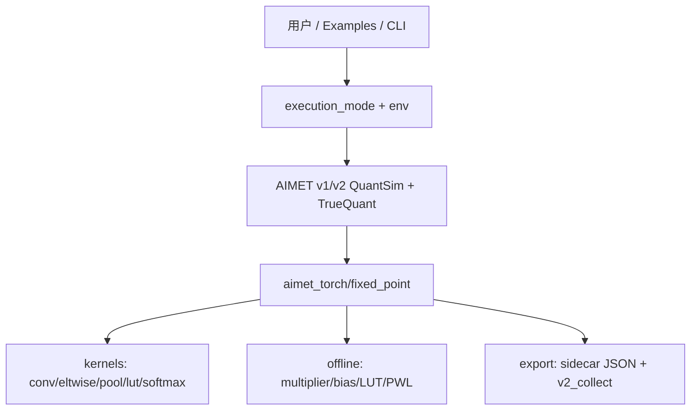

# AIMET RX 定点量化扩展 — 项目总览与验收核实

**文档版本**：2026-05-20  
**代码仓库**：`aimet_rx`  
**关联设计**：[`FixedPoint_Quantization_Design_v2.md`](FixedPoint_Quantization_Design_v2.md)（当前顶层设计）、[`INTERFACE.md`](../aimet_torch/v2/quantization/affine/fixed_point/INTERFACE.md)（接口契约）

---

## 1. 项目目的

`aimet_rx` 在 Qualcomm **AIMET** 基础上，为面向 **Ada200 系列 NPU** 的部署链路增加可切换的量化**执行模式**，使仿真与导出更贴近硬件：

| 模式 | 含义 | 业务价值 |
|------|------|----------|
| `fp32_qdq` | 默认伪量化，计算用 FP32 | 与上游 AIMET 100% 兼容；PTQ/QAT 校准 |
| `fp16_qdq` | 伪量化后 FP16 参与算子（experimental） | FP16 推理/训练实验 |
| **`fixed_scale_qdq`** | Q/DQ 用 `(m_int16, rshift)`，段内仍 Op_float | **Ada200 部署主路径**（M2.5） |
| `int16_fixed_eval` | 整数 MAC + 层间 requant | 硬件整数对拍（不可替代板端 sign-off） |
| `int16_fixed_qat_sim` | 前向同 eval，反向 STE | 整数行为约束下可选 QAT |

**两条仿真路径**（Design v2 §3.1）：`fixed_scale_qdq` 与 `int16_fixed_eval` **数值不等价**；前者用于 PTQ/导出门禁，后者用于硅前整数语义。

**非目标**（Design v2 §2.2）：替代编译器/NPU runtime；全网 `torch.int16`；用 QDQ 代替板端 sign-off；Po2 scale 非 Ada200 前置。

**v1 G2 范围**（2026-05-20）：`StaticGridQuantWrapper` + STE 路径已接 `fixed_scale_qdq`（`aimet_torch/v1/fixed_scale_qdq.py`）；LearnedGrid QAT 在 fixed_scale 下前向用 `(M,r)`、反向仍走 float STE（与 v2 主路径一致策略）。

**非目标**（工程）：未注册 kernel 默认 `KernelNotFoundError`，不静默 float fallback。

---

## 2. 设计思想与原则

1. **默认不变**：未设置模式时行为等同标准 AIMET `fp32_qdq`。
2. **显式切换**：通过 API / 环境变量 `AIMET_RX_QUANT_EXECUTION_MODE` 开启新路径，避免静默 fallback（ADR-005、R-005）。
3. **v2 主路径、v1 薄适配**：定点内核集中在 `aimet_torch/fixed_point/`，v1/v2 各写 adapter（ADR-005）。
4. **真定点 ≠ `tensor.to(int16)`**：乘加、requantize、饱和、LUT 均有独立语义（见 INTERFACE）。
5. **可观测**：`metrics/`、`scripts/fixed_point/run_quality_report.py` 输出 cosine、LSB、SQNR 等，可与 `baseline.json` 对照。

### 2.1 核心原理（INT16 路径）

```text
浮点域（仅离线）:  real_multiplier = x_scale * w_scale / y_scale
                         ↓ quantize_multiplier (Q15)
运行时（整数）:   acc_int32 = Σ (x_int16 - x_zp) * (w_int16 - w_zp) + bias_int32
                         ↓ requantize_int: y = saturate( round_shift(acc * multiplier) )
输出:            Int16QuantizedTensor(data=int16, encoding=OutputEncoding)
```

- **Requantize**：`(x * multiplier) >> rshift`，溢出 **saturate**（ADR-004）。
- **舍入**：默认 `round half to even`（ADR-008，待硬件最终确认）。
- **非线性**：PWL/LUT 分阶段交付（ADR-007）；Sigmoid/Tanh/GELU/SiLU 等走离线生成的 INT16 查表。

### 2.2 架构分层



---

## 3. 实现地图（代码）

| 模块 | 路径 | 职责 |
|------|------|------|
| 模式 API | `aimet_torch/fixed_point/execution_mode.py` | `ExecutionMode`、`set_quant_execution_mode`、`quant_execution_mode` |
| 定点 scale Q/DQ | `fixed_scale_qdq.py`, `offline/scale_fixed.py` | G2：`quantize_scale_to_m_rshift`、`convert_encodings_to_fixed_scale` |
| 张量与编码 | `tensor.py`, `encoding.py`, `encoding_export.py` | `Int16QuantizedTensor`（别名 `FixedPointSimTensor`）、`m_int16`/`rshift` 导出 |
| G3 边界 Q | `boundary_quantize.py` | `convert` 缓存或 `AIMET_RX_INT16_BOUNDARY_USE_M_R=1` 时与 G2 对齐 |
| INT16 freeze | `offline/pipeline.py`, `examples/freeze_int16_fixed.py` | `freeze_int16_fixed` → sidecar |
| Requantize | `requantize.py`, `rounding.py` | 整数缩放、饱和、舍入模式 |
| 算子注册 | `registry.py`, `kernels/*` | `FixedKernel` 协议与 Conv/Linear/Add/Pool/LUT 等 |
| v2 接入 | `aimet_torch/v2/quantization/affine/fixed_point/adapter.py` | `dispatch_int16_fixed` |
| v1 接入 | `aimet_torch/v1/fixed_point_dispatch.py` | v1 INT16 分派 |
| v1 G2 适配 | `aimet_torch/v1/fixed_scale_qdq.py` | StaticGrid Q/DQ + STE 前向 `(M,r)` |
| QAT | `qat.py` | `FakeQuantInt16STE`、`int16_fixed_qat_sim` |
| 离线参数 | `offline/lut_gen.py` 等 | multiplier、bias_int32、PWL LUT |
| 指标与报告 | `metrics/*`, `scripts/fixed_point/*` | 对比、阈值、质量报告 |
| 导出 | `export/sidecar.py`, `export/v2_collect.py` | `aimet_rx_int16_fixed_sidecar` JSON |
| E2E 辅助 | `fixed_point/e2e/mobilenet_v2.py` | Mock/完整 MobileNet 管线 |

**已知未实现/受限**：

- `Conv3d`：参考实现（float 卷积 + round）；大累加域需与硬件对拍。
- 部分 eltwise 变体在特定配置下 `NotImplementedError`。
- PWL 离线生成：**仅支持 per-tensor encoding**（`lut_gen.py`）。

---

## 4. 使用指南

### 4.1 环境

```bash
cd aimet_rx
pip install -r requirements.txt   # 含 PyTorch、AIMET 依赖
export PYTHONPATH="$(pwd)"
```

E2E（MobileNet）测试额外需要：`torchvision`、`onnxscript`。

### 4.2 切换执行模式

```python
from aimet_torch.fixed_point import (
    ExecutionMode,
    quant_execution_mode,
    set_quant_execution_mode,
)

# 进程级
set_quant_execution_mode(ExecutionMode.FP16_QDQ)

# 推荐：可嵌套恢复
with quant_execution_mode(ExecutionMode.INT16_FIXED_EVAL):
    out = model(x)  # v2 TrueQuant 模块走整数 kernel

# 或通过环境变量（进程启动时）
# export AIMET_RX_QUANT_EXECUTION_MODE=int16_fixed_eval
```

INT16 推理前，对 `QuantizationSimModel` 需保证输出 quantizer 已物化（否则部分层无 output encoding）：

```python
from aimet_torch.fixed_point import ensure_output_quantizers_for_int16_eval

ensure_output_quantizers_for_int16_eval(sim)
```

### 4.3 质量验收（推荐命令）

```bash
# 快速：跳过 pytest 与完整 MobileNet，对照 baseline.json
bash scripts/fixed_point/run_report_fast.sh

# 完整：含 tests/fixed_point pytest 汇总
bash scripts/fixed_point/run_report.sh

# 仅核对已有报告
PYTHONPATH=. python3 scripts/fixed_point/check_thresholds.py \
  --from-quality-report scripts/fixed_point/reports/quality_report.json

# 单元 + 算子测试（较快）
PYTHONPATH=. python3 -m pytest tests/fixed_point/kernels tests/fixed_point/metrics \
  tests/fixed_point/offline tests/fixed_point/qat tests/fixed_point/export -q

# 跳过慢测（不含 full MobileNet、长 PTQ/QAT）
PYTHONPATH=. python3 -m pytest tests/fixed_point -m "not slow" -q
```

报告输出：`scripts/fixed_point/reports/quality_report.md` 与 `.json`。

### 4.4 与标准 AIMET 流程的关系

- 通用 QuantSim / PTQ / QAT / ONNX 导出：见 `examples/quick_start.py`、`doc/Quant_config.md`。
- 定点扩展**叠加**在 TrueQuant 前向之上，不改变默认 `fp32_qdq` 下的 encodings 兼容性（设计文档 §9.3）。

---

## 5. 里程碑与 spec 对照

| 里程碑 | 内容 | 实现结论 | 主要证据 |
|--------|------|----------|----------|
| **M1** | 模式框架 | **已完成** | `execution_mode.py`，`test_execution_mode.py` |
| **M2** | fp16_qdq v2/v1 | **已完成** | `test_fp16_qdq_backend.py`，质量报告 |
| **M2.5** | fixed_scale_qdq + sidecar | **已完成** | `test_fixed_scale_qdq.py`，MobileNet e2e，`baseline.json` |
| **M3** | INT16 核心 | **已完成** | `tensor`/`requantize`/`registry`/`conv_linear`，对应单测 |
| **M4** | Pool/shape/LUT | **已完成** | `kernels/*`，`test_lut.py`，PWL 报告 §1 |
| **M5** | 离线参数 + QAT | **已完成** | `offline/*`，`qat/test_ste.py`，报告 §5 QAT |
| **M6** | 指标、测试、CI | **已完成** | 质量报告、baseline、`.github/workflows/fixed_point_ci.yml` |

详细 spec 仍位于 `aimet_rx/doc/FixedPoint_Quantization_Spec/`（状态字段仍为 `accepted`，见 §7）。

---

## 6. 验收核实（对照 Design v2 §10）

### 6.1 功能与精度门槛

| 对比 | Design v2 门槛 | 仓库门禁 / 测试 |
|------|----------------|-----------------|
| `fp16_qdq` vs `fp32_qdq` | cosine ≥ 0.9995 | `baseline.json` 0.9999；单测 + 质量报告 |
| **`fixed_scale_qdq` vs `fp32_qdq`** | top1 ≤ 0.1%（评审可调） | **cosine ≥ 0.9998**（`baseline.json`、MobileNet e2e、单测） |
| `int16_fixed_eval` vs `fp32_qdq` | 报告型，无等价阈值 | mock MobileNet ≥ 0.99 |
| 默认兼容 | `fp32_qdq` 不变 | 默认 `ExecutionMode.FP32_QDQ` |

**G2 运行时语义**（2026-05-20 对齐 spec 15 / INTERFACE）：`fixed_scale_qdq` 从校准 float `scale` 生成 `(M,r)` 做 Q/DQ，**不用** float scale 乘子；sidecar 反序列化缺 `m_int16`/`rshift` 则 `ValueError`。

**未闭环**：ADR-008 舍入待硬件 bit-exact；v1 无 G2；全量 ImageNet slow 测需本地重跑。

### 6.2 本机 pytest 抽查（同日）

| 批次 | 结果 |
|------|------|
| 核心模式/张量/registry/requantize/fp16（17 项） | **17 passed** |
| kernels + metrics + offline + qat + export（56 项） | **56 passed** |
| adapter + tiny e2e（13 项） | **13 passed, 1 skipped** |
| **合计（已跑）** | **86 passed, 1 skipped** |
| 全量收集 | `99 tests`（`pytest --collect-only`） |

**未在本会话跑完**（耗时长或 `@pytest.mark.slow`）：`test_mobilenet_v2.py`（模块级 fixture 校准）、`test_mobilenet_v2_ptq_qat.py`、`test_full_mobilenet_v2.py`。质量报告 §6 注明生成时使用了 `--skip-pytest`，**不能**用报告中的 pytest 行代替本地全量测试。

### 6.3 总体结论

| 维度 | 判定 |
|------|------|
| **功能目标（M1–M2.5–M6 + G1–G3，v2 主路径）** | **已达到预期**；G2/G3 分工与 Design v2 一致 |
| **工程闭环（M6 CI、golden npz、覆盖率 85%）** | **CI + `.coveragerc` ≥85% + golden npz** 已落地 |
| **风险项** | ADR-008 舍入待硬件确认；部分 eltwise 变体未覆盖 |

**一句话**：业务相关的定点模式、内核、离线参数、指标与 Mock MobileNet E2E **已验收通过**；CI 与部分测试资产仍属后续工程项。

---

## 7. 差距与建议后续

1. ~~**落地 CI**~~：已添加 `.github/workflows/fixed_point_ci.yml`。
2. ~~**扩展 golden / 覆盖率**~~：已含 `requantize_basic`、`conv2d_basic` npz；CI 覆盖率 **85.8%**（2026-05-20）。
3. **更新 spec Status**：将已实现 spec 标为 `implemented`（15 已为 implemented）。
4. ~~**覆盖率门禁**~~：CI ≥85% 已启用。
5. **硬件对齐**：确认舍入规则后做 bit-exact 回归（ADR-008）。
6. ~~**v1 G2**~~：StaticGrid + STE 薄适配已落地（见 §1 v1 G2 范围）。
7. **重跑全量测试**：`make test-fixed-point-fast` 或 `pytest tests/fixed_point -m "not slow"`。

---

## 8. 文档索引

| 文档 | 用途 |
|------|------|
| [FixedPoint_Quantization_Design_v2.md](FixedPoint_Quantization_Design_v2.md) | **当前**顶层设计（G1–G3、双路径、验收） |
| [FixedPoint_Quantization_Design.md](FixedPoint_Quantization_Design.md) | 历史归档（勿作需求依据） |
| [FixedPoint_Quantization_Spec/](FixedPoint_Quantization_Spec/) | 分模块 spec（01–15，M2.5=15） |
| [INTERFACE.md](../aimet_torch/v2/quantization/affine/fixed_point/INTERFACE.md) | API/字段单一事实源 |
| [Quant_config.md](Quant_config.md) | AIMET 双层 JSON 量化配置 |
| [quality_report.md](../scripts/fixed_point/reports/quality_report.md) | 最近一次自动化质量报告 |
| [baseline.json](../scripts/fixed_point/baseline.json) | 回归阈值配置 |

---

## 9. 修订记录

| 日期 | 说明 |
|------|------|
| 2026-05-19 | 初版：验收核实、总览、使用说明；基于设计文档与代码/报告抽查 |
| 2026-05-20 | 对齐 Design v2：M2.5/fixed_scale、双路径、baseline 门槛、G2 运行时语义 |
